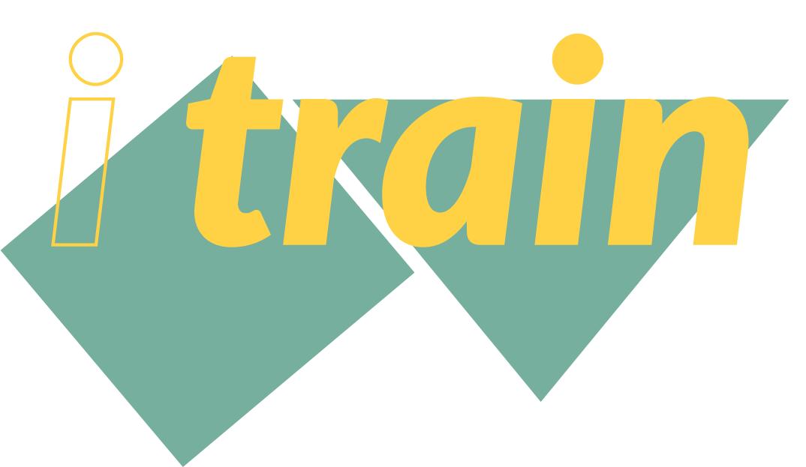
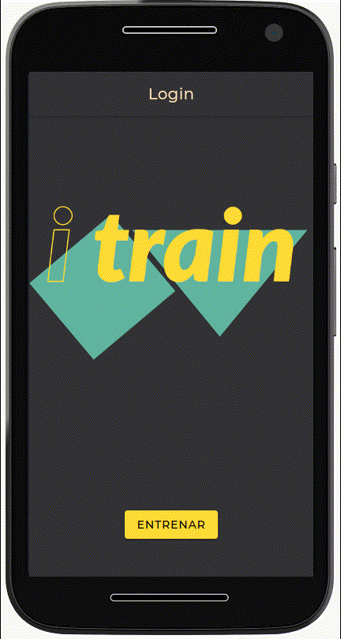
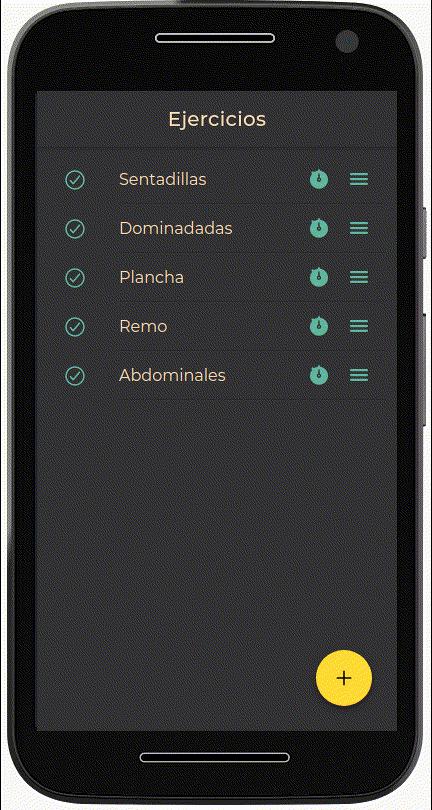
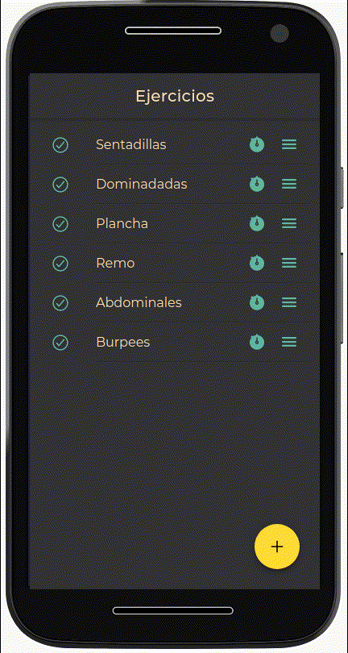

 
 

<h2>                                           [Video explicativo](https://youtu.be/G0KQ8WiFRAg) </h2>

 
 

# ¿ Qué es I train ?

I train es una aplicación pensada para organizar tus entrenamientos, en la que podrás almacenar tus ejercicios con duración, repeticiones y descansos entre repeticiones del ejercicio.
 
 

# Inicio

De entrada nos encontramos con la pagina principal en la que un botón central nos redirige a nuestros entrenamientos.

 
 

# Crear ejercicio 

Mediante inputs, introducimos el nombre y descripción del ejercicio, después solo tenemos que configurar los tiempos de duración y descansos e introducir las repeticiones de las series.

 
 

# Timer 

De momento esta en fase de pruebas, pero básicamente se basa en un cronómetro deportivo.

 
 

# Edición y borrado de ejercicios

El mismo menú que tenemos para crear un ejercicio nos sirve para editarlo, este cambia en función de si es un nuevo ejercicio o uno ya existente.

 
 

**App híbrida creada en Ionic y Angular.**
_Este proyecto ha sido creado para la asignatura de Acceso a datos del curso de desarrollo de aplicaciones multiplataforma
del Instituto IES Campanillas._
n
